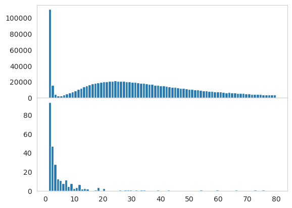
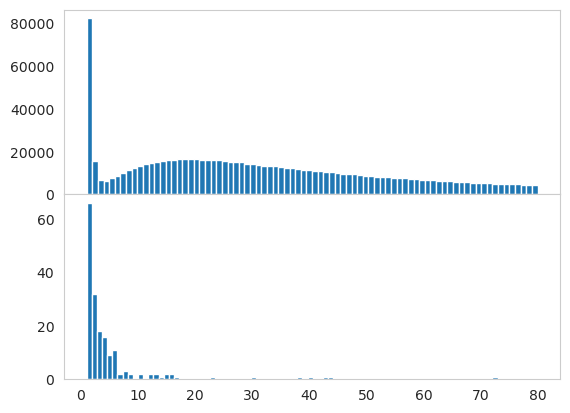

# Variant Abundance Analysis

This script takes pre-processed sequence files (parquet files) containing
regions designated for mutagenesis (mutated) and surrounding bases
(non-mutated). To determine the proportion of false positives DNA variant
calls given all reads, the mutated regions (12 bases) were compared to 12
randomly selected bases from the non-mutated regions for each library. The
resulting distribution of variant abundances for both the mutated and
non-mutated regions can then be compared to set abundance thresholds. Abundance
thresholds are arbitrary but computationally necessary. We justify our
selection here by looking for a natural break in the distributions.
Proportion of false positive variant calls given all reads can then be
determined for user-selected abundance thresholds.


```python
import os
import glob
import matplotlib.pyplot as plt
import numpy as np
import dask.dataframe as dd
```

Set root directory


```python
root_dir = "/media/scratch/post_analysis"
print(f"Root directory: {root_dir}")

```

    Root directory: /media/scratch/post_analysis


Set `home_folder`


```python
home_folder = "merged/QCend"
home_dir = os.path.join(root_dir, home_folder)
print(f"Home directory: {home_dir}")

```

    Home directory: /media/scratch/post_analysis/merged/QCend


Set directory based on `folder` and `output_folder` specified below.


```python
folder = "variant_analysis"
output_folder = "abundance_analysis"

os.chdir('/media/scratch/post_analysis/')
os.chdir(os.path.join(home_dir, folder))
work_dir = os.getcwd()
print(f"Current working directory: {work_dir}")
output_dir = os.path.join(home_dir, output_folder)
print(f"Output directory: {output_dir}")

```

    Current working directory: /media/scratch/post_analysis/merged/QCend/variant_analysis
    Output directory: /media/scratch/post_analysis/merged/QCend/abundance_analysis


Get files by specifying `name`.


```python
name = "*.parquet"

def get_files(name):
    print("Getting files")
    files = sorted([file for file in glob.glob(name)])
    for file in files:
        print(file)
    return files


files = get_files(name)
print("Done")

```

    Getting files
    non_conserved_Ga.parquet
    non_conserved_H3.parquet
    Done


Read `parquet` files into DataFrame.


```python
for file in files:
    if "Ga" in file:
        print(f"Getting {file} for Ga")
        Ga = file
    elif "H3" in file:
        print(f"Getting {file} for H3")
        H3 = file

print(f"Reading Ga_dna")
non_conserved_Ga_dna = dd.read_parquet(Ga,
                     engine='pyarrow')['seq'].compute()

print(f"Reading H3_dna")
non_conserved_H3_dna = dd.read_parquet(H3,
                     engine='pyarrow')['seq'].compute()

print("Done")

```

    Getting non_conserved_Ga.parquet for Ga
    Getting non_conserved_H3.parquet for H3
    Reading Ga_dna
    Reading H3_dna
    Done


```python
folder = "data/trimmed"
output_folder = "abundance_analysis"

os.chdir('/media/scratch/post_analysis/')
os.chdir(os.path.join(home_dir, folder))
work_dir = os.getcwd()
print(f"Current working directory: {work_dir}")
output_dir = os.path.join(home_dir, output_folder)
print(f"Output directory: {output_dir}")

```

    Current working directory: /media/scratch/post_analysis/merged/QCend/data/trimmed
    Output directory: /media/scratch/post_analysis/merged/QCend/abundance_analysis


Get files for `conserved_Ga_dna`.


```python
name = "*Ga*.parquet"

def get_files(name):
    print("Getting files")
    files = sorted([file for file in glob.glob(name)])
    for file in files:
        print(file)
    return files


files = get_files(name)
print("Done")

```

    Getting files
    trimmed_Ga_A1_S1_L001_R2_001.parquet
    trimmed_Ga_A2_S2_L001_R2_001.parquet
    trimmed_Ga_A3_S3_L001_R2_001.parquet
    trimmed_Ga_A4_S4_L001_R2_001.parquet
    trimmed_Ga_B1_S5_L001_R2_001.parquet
    trimmed_Ga_B2_S6_L001_R2_001.parquet
    trimmed_Ga_B3_S7_L001_R2_001.parquet
    trimmed_Ga_B4_S8_L001_R2_001.parquet
    trimmed_Ga_C1_S9_L001_R2_001.parquet
    trimmed_Ga_C2_S10_L001_R2_001.parquet
    trimmed_Ga_C3_S11_L001_R2_001.parquet
    trimmed_Ga_C4_S12_L001_R2_001.parquet
    trimmed_Ga_D1_S13_L001_R2_001.parquet
    trimmed_Ga_D2_S14_L001_R2_001.parquet
    trimmed_Ga_D3_S15_L001_R2_001.parquet
    trimmed_Ga_D4_S16_L001_R2_001.parquet
    Done


Randomly select 12 conserved (non-mutated) positions (with replacement) and
construct `conserved_Ga_dna`.


```python
dfs = []
for file in files:
    df = dd.read_parquet(file,
                         engine='pyarrow')
    dfs.append(df)

print("Concatenating DataFrames")
ddf = dd.concat(dfs)

print("Randomly selecting 12 positions")
pool = ddf.columns.values
sample = np.random.choice(pool, 12, replace=True)
ddf = ddf[sample]

print("Merging selected positions into one seq")
conserved_Ga_dna = ddf.apply(''.join, axis=1, meta=('seq', 'string')).compute()

print("Done")
```

    Concatenating DataFrames
    Randomly selecting 12 positions
    Merging selected positions into one seq
    Done


Get files for `conserved_H3_dna`.


```python
name = "*H3*.parquet"

def get_files(name):
    print("Getting files")
    files = sorted([file for file in glob.glob(name)])
    for file in files:
        print(file)
    return files


files = get_files(name)
print("Done")

```

    Getting files
    trimmed_H3_A1_S17_L001_R2_001.parquet
    trimmed_H3_A2_S18_L001_R2_001.parquet
    trimmed_H3_A3_S19_L001_R2_001.parquet
    trimmed_H3_A4_S20_L001_R2_001.parquet
    trimmed_H3_B1_S21_L001_R2_001.parquet
    trimmed_H3_B2_S22_L001_R2_001.parquet
    trimmed_H3_B3_S23_L001_R2_001.parquet
    trimmed_H3_B4_S24_L001_R2_001.parquet
    trimmed_H3_C1_S25_L001_R2_001.parquet
    trimmed_H3_C2_S26_L001_R2_001.parquet
    trimmed_H3_C3_S27_L001_R2_001.parquet
    trimmed_H3_C4_S28_L001_R2_001.parquet
    trimmed_H3_D1_S29_L001_R2_001.parquet
    trimmed_H3_D2_S30_L001_R2_001.parquet
    trimmed_H3_D3_S31_L001_R2_001.parquet
    trimmed_H3_D4_S32_L001_R2_001.parquet
    Done


Randomly select 12 conserved (non-mutated) positions (with replacement) and
construct `conserved_H3_dna`.


```python
dfs = []
for file in files:
    df = dd.read_parquet(file,
                         engine='pyarrow')
    dfs.append(df)

print("Concatenating DataFrames")
ddf = dd.concat(dfs)

print("Randomly selecting 12 positions")
pool = ddf.columns.values
sample = np.random.choice(pool, 12, replace=True)
ddf = ddf[sample]

print("Merging selected positions into one seq")
conserved_H3_dna = ddf.apply(''.join, axis=1, meta=('seq', 'string')).compute()

print("Done")
```

    Concatenating DataFrames
    Randomly selecting 12 positions
    Merging selected positions into one seq
    Done


```python
non_conserved_Ga_dna
```


    0         TTTCCTTGTGTT
    1         CATACGGCGTGG
    2         TATGGGCCTATG
    3         ATTGCTGCGCGG
    4         GGGGGGGTGTAG
                  ...     
    554322    AGTAATAATGCG
    554323    TTGTGTTATGAT
    554324    AGTGAGTGGAGT
    554325    CATATTTCTATT
    554326    CGTGCTTGTGTT
    Name: seq, Length: 47705940, dtype: object


```python
non_conserved_H3_dna
```


    0         TAGTTTAGTTTT
    1         TGTTGTTTTCTT
    2         TTTCCGGATTAG
    3         GATAATTTTAAT
    4         TGTCGTAGGTAT
                  ...     
    542951    ATTGAGGAGTGT
    542952    GAGTATAGTAAG
    542953    GGGGGTATGGGG
    542954    TCGTTTCTGGGT
    542955    TTTAATATGTCT
    Name: seq, Length: 65779138, dtype: object


```python
conserved_Ga_dna
```


    0         ACAGCAGAGAAC
    1         ACAGCAGAGAAC
    2         ACAGCAGAGAAC
    3         ACAGCAGAGAAC
    4         ACAGCAGAGAAC
                  ...     
    554322    ACAGCAGAGAAC
    554323    ACAGCAGAGAAC
    554324    ACAGCAGAGAAC
    554325    ACAGCAGAGAAC
    554326    ACAGCAGAGAAC
    Name: seq, Length: 47705940, dtype: object


```python
conserved_H3_dna
```


    0         CTGCTTGGGGCC
    1         CTGCTTGGGGCC
    2         CTGCTTGGGGCC
    3         CTGCTTGGGGCC
    4         CTGCTTGGGGCC
                  ...     
    542951    CTGCTTGGGGCC
    542952    CTGCTTGGGGCC
    542953    CTGCTTGGGGCC
    542954    CTGCTTGGGGCC
    542955    CTGCTTGGGGCC
    Name: seq, Length: 65779138, dtype: object


Count unique dna variants for the non-conserved (mutated) and conserved
(non-mutated) regions.


```python
print(f"Counting unique dna variants for non_conserved_Ga_dna")
non_conserved_Ga_count_dna = non_conserved_Ga_dna.value_counts()
print(f"Counting unique dna variants for non_conserved_H3_dna")
non_conserved_H3_count_dna = non_conserved_H3_dna.value_counts()
print(f"Counting unique dna variants for conserved_Ga_dna")
conserved_Ga_count_dna = conserved_Ga_dna.value_counts()
print(f"Counting unique dna variants for conserved_H3_dna")
conserved_H3_count_dna = conserved_H3_dna.value_counts()

print("Done")
```

    Counting unique dna variants for non_conserved_Ga_dna
    Counting unique dna variants for non_conserved_H3_dna
    Counting unique dna variants for conserved_Ga_dna
    Counting unique dna variants for conserved_H3_dna
    Done


```python
non_conserved_Ga_count_dna
```


    GATTGTGGTTTC    117019
    ATTTTTTTTTTT      1218
    TTTTTTTTTTTT      1179
    ATTATTTTTTTT       872
    ATTTATTTTTTT       855
                     ...  
    GGGGTAGGGGCT         1
    TGTGGGGTTAAC         1
    CCGGTTGAGCCA         1
    AGCTATCGTGGG         1
    TTTCAATTTGCT         1
    Name: seq, Length: 1169738, dtype: int64


```python
non_conserved_H3_count_dna

```


    CTGGAAATTGCC    79396
    TTTTTTTTTTTT     2702
    TTTTTTTGTTTT     2222
    TTTTTTTTGTTT     2086
    TTTTTTTTTGTT     2077
                    ...  
    TGGAGATATGCT        1
    TTTGGGTTTCTC        1
    AGTAAAATTATT        1
    ATTTGGTTACCG        1
    GATTCTCTATAT        1
    Name: seq, Length: 1144589, dtype: int64


```python
conserved_Ga_count_dna

```


    ACAGCAGAGAAC    47373328
    ACAGCAAAGAAC       62269
    ACAGCAGAAAAC       59953
    ACAGCAGAGAAT       59607
    ACGGCAGAGAAC       20419
                      ...   
    CCAACATAGCAC           1
    ACAGACGAGAAC           1
    ACAGCAGAAACC           1
    ACAGCAGATAGC           1
    GCAGCGGAGGAC           1
    Name: seq, Length: 307, dtype: int64


```python
conserved_H3_count_dna

```


    CTGCTTGGGGCC    65461099
    CTACTTGGGGCC       83851
    CTGCTTGGAGCC       60081
    CTGCTTGAGACC       50529
    CTGCTTGTGTCC       12835
                      ...   
    TTGCTTGTGTCC           1
    CTGCGTGTGTCC           1
    ATGCTTGGTGCC           1
    CTGCGTGGAGCC           1
    CAGCTAGGTGCC           1
    Name: seq, Length: 218, dtype: int64


Function for selecting part of the results for the plots. Return dataframe
with unique sequences and their respective count if the count is lower or
equal to the specified upperbound value.


```python
def select_data(data, upperbound):
    return data[data <= upperbound]
```

Making plots for abundance distribution.


```python
fig, (ax1, ax2) = plt.subplots(2, sharex=True)
ax1.hist(select_data(non_conserved_Ga_count_dna, 80), bins=80)
ax2.hist(select_data(conserved_Ga_count_dna, 80), bins=80)
ax1.grid(False)
ax2.grid(False)
fig.subplots_adjust(hspace=0)
out = os.path.join(output_dir, "Ga_abundance.pdf")
# plt.savefig(out, dpi=300)
plt.show()

```


    

    


```python
nc_Ga = select_data(non_conserved_Ga_count_dna, 80).value_counts()
```


```python
nc_Ga
```


    1     110493
    24     21350
    26     21217
    25     21077
    27     21041
           ...  
    6       3960
    79      3932
    80      3838
    5       2908
    4       2638
    Name: seq, Length: 80, dtype: int64


```python
c_Ga = select_data(conserved_Ga_count_dna, 80).value_counts()
```


```python
c_Ga
```


    1     93
    2     47
    3     28
    4     13
    7     12
    5     11
    9      8
    6      8
    12     7
    8      5
    11     4
    18     4
    10     3
    20     3
    14     3
    15     2
    13     2
    76     1
    73     1
    26     1
    28     1
    29     1
    30     1
    31     1
    33     1
    34     1
    39     1
    43     1
    54     1
    60     1
    66     1
    17     1
    Name: seq, dtype: int64


```python
fig, (ax1, ax2) = plt.subplots(2, sharex=True)
ax1.hist(select_data(non_conserved_H3_count_dna, 80), bins=80)
ax2.hist(select_data(conserved_H3_count_dna, 80), bins=80)
ax1.grid(False)
ax2.grid(False)
fig.subplots_adjust(hspace=0)
out = os.path.join(output_dir, "H3_abundance.pdf")
# plt.savefig(out, dpi=300)
plt.show()

```


    

    


```python
nc_H3 = select_data(non_conserved_H3_count_dna, 80).value_counts()
```


```python
nc_H3
```


    1     82270
    19    16542
    17    16516
    18    16428
    20    16411
          ...  
    76     4870
    77     4718
    78     4626
    79     4456
    80     4366
    Name: seq, Length: 80, dtype: int64


```python
c_H3 = select_data(conserved_H3_count_dna, 80).value_counts()
```


```python
c_H3
```


    1     66
    2     32
    3     18
    4     16
    6     11
    5      9
    8      3
    12     2
    7      2
    9      2
    10     2
    13     2
    15     2
    16     2
    44     1
    14     1
    17     1
    23     1
    30     1
    38     1
    40     1
    43     1
    73     1
    Name: seq, dtype: int64


Calculate false positive given all reads. Specify abundance threshold by
looking for a natural break in the plots above (as recommended by Rosen et al
., 2012 (refer to paper for full citation)). The function will filter out
sequences with counts below the specified abundance threshold.


```python
def FPR_cal(abundance):
    for i in range(abundance):
        num = i + 1
        Ga_positive = conserved_Ga_count_dna[conserved_Ga_count_dna >= num]
        H3_positive = conserved_H3_count_dna[conserved_H3_count_dna >= num]
        Ga_negative = conserved_Ga_count_dna[conserved_Ga_count_dna < num]
        H3_nagative = conserved_H3_count_dna[conserved_H3_count_dna < num]

        Ga_total = Ga_positive.sum() + Ga_negative.sum()
        Ga_FP = Ga_positive.sum() - Ga_positive.max()
        Ga_FPR = (Ga_FP / Ga_total) * 100
        print(f"False positive percentage for Ga = {Ga_FPR} (abundance = "
              f"{num})")

        H3_total = H3_positive.sum() + H3_nagative.sum()
        H3_FP = H3_positive.sum() - H3_positive.max()
        H3_FPR = (H3_FP / H3_total) * 100
        print(f"False positive percentage for H3 = {H3_FPR} (abundance = "
              f"{num})")

    return None

FPR_cal(5)
print("Done")

```

    False positive percentage for Ga = 0.6972129676094843 (abundance = 1)
    False positive percentage for H3 = 0.4834952382623196 (abundance = 1)
    False positive percentage for Ga = 0.6970180233321049 (abundance = 2)
    False positive percentage for H3 = 0.4833949024993304 (abundance = 2)
    False positive percentage for Ga = 0.6968209828797001 (abundance = 3)
    False positive percentage for H3 = 0.4832976072140076 (abundance = 3)
    False positive percentage for Ga = 0.6966449041775511 (abundance = 4)
    False positive percentage for H3 = 0.4832155143170164 (abundance = 4)
    False positive percentage for Ga = 0.6965359030762207 (abundance = 5)
    False positive percentage for H3 = 0.48311821903169355 (abundance = 5)
    Done
